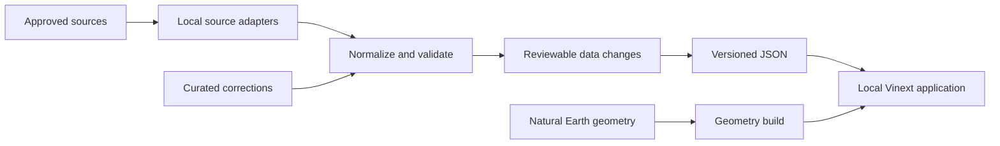

# Polity Atlas: Local-First Implementation Plan

## Decision and current repository

**18 September 2026:** GitHub Pages deployment has been abandoned. The application runs on the developer's machine at `http://localhost:3000` (or the port printed by the development server). GitHub remains the source repository and pull-request review surface. There is no hosted production site or automatic deployment target in this phase. Local data stays on the machine unless deliberately committed as reviewed, public data.

The existing repository is the Phase 1 implementation baseline. It uses npm and `package-lock.json`, Vinext with Next-style `app` conventions on Vite, static App Router output, Tailwind CSS and shadcn primitives, semantic theme tokens, and system fonts. These accepted decisions supersede the original proposal's pnpm workspace, plain React/Vite shell, hash router, CSS Modules, and immediate self-hosted fonts. Keep the implemented structure unless a separate architecture decision changes it.

### Run and verify from a fresh clone

Requires Node.js 22.13 or later and npm. From the repository root:

```sh
npm ci
npm run dev
```

Open the localhost URL printed by Vinext. To check a change, run `npm run typecheck`, `npm run lint`, `npm run format:check`, `npm test`, and `npm run build`. The build writes a local static export to `dist/client`; it does not publish it. Keep `.env*` and local caches ignored and never place private source credentials in browser-visible variables. A local preview is complete when a fresh clone starts, loads the bundled pilot data and map, and works after a browser refresh.

## 1. Product definition

Build a citation-first geopolitical research application centered on an interactive world map. A user can search for or select a country, inspect its government, leaders, parliament, political parties, election calendar, and diplomatic representation, and visually trace related countries on the map.

This plan assumes “county” in the brief means **country**. Subnational counties, provinces, constituencies, and electoral districts should be treated as later data layers, not part of the first release.

The product should optimize for three things:

1. **Fast retrieval:** a country profile should be usable within one click and one second after its data file is cached.
2. **Traceability:** every displayed claim must link to at least one source and include an “as of” or retrieval date.
3. **Safe evolution:** data ingestion, geographic rendering, and interface components must be separate modules so new topics and sources can be added without rewriting the app.

### First production release

The first full release should provide:

- A clickable and keyboard-searchable world map.
- A profile for every supported sovereign state and separately identified territory.
- Current heads of state and government.
- Legislature name, chamber structure, seat counts, party composition, presiding officers, last election, and next known or expected election.
- Party profiles with abbreviation, leaders, seats by chamber, official links, and sourced ideological descriptions where reliable data exists.
- Upcoming national elections with clearly distinguished `confirmed`, `tentative`, and `expected` dates.
- Diplomatic mission relationships, including resident embassy/high commission, non-resident accreditation, interests section, suspended mission, or no diplomatic relations where a reliable source establishes it.
- A source link beside each fact group and a complete Sources tab.
- Light and dark themes.
- A primary country slide-over and a desktop window workspace for pinned comparisons.
- Local operation from a fresh clone, with reproducible data and a documented verification path.

## 2. Recommended architecture

The local Vinext application reads reviewed, citation-bearing JSON in `public/data`. Source ingestion is a separate, explicit developer task: use approved adapters, validate and review changes, and commit only publishable data. No network source call is required when opening a country profile. CI checks committed changes but does not deploy or schedule ingestion.



Private API credentials live in local ignored environment files or an approved credential store, and are used only by explicit ingestion commands. They never enter committed JSON or the browser bundle. The browser can still follow citations to external sites; the core map and bundled profiles should work without a source API being available.

## 3. Exact software stack

| Area                     | Choice                                                                                   | Reason                                                                         |
| ------------------------ | ---------------------------------------------------------------------------------------- | ------------------------------------------------------------------------------ |
| Area                     | Accepted choice                                                                          | Reason                                                                         |
| ---                      | ---                                                                                      | ---                                                                            |
| Language                 | Strict TypeScript                                                                        | Shared contracts and early validation.                                         |
| Application              | Vinext and Vite, using the existing Next-style `app` structure                           | Matches the working local application.                                         |
| Package management       | npm and committed `package-lock.json`                                                    | Reproducible `npm ci` locally and in CI.                                       |
| Mapping                  | SVG Mercator atlas with Natural Earth geometry; MapLibre reserved for detailed/local GIS | Deterministic global political rendering without a hosted tile dependency.     |
| Remote/static data cache | TanStack Query                                                                           | Loads and caches profile files.                                                |
| Workspace state          | Zustand                                                                                  | Local selection, theme, and future pinned-window layout.                       |
| Routing                  | Existing static App Router output                                                        | Direct localhost routes and browser refresh; no Pages subpath or hash routing. |
| Validation               | Zod and Vitest                                                                           | Shared schema and data tests.                                                  |
| Styling                  | Tailwind CSS, shadcn primitives, semantic CSS variables                                  | Matches the implemented UI foundation.                                         |
| Browser tests            | Playwright and axe-core when introduced                                                  | Selection, routing, theme, and accessibility checks.                           |
| Lint/format              | oxlint and oxfmt                                                                         | Matches repository scripts.                                                    |
| Data scripts             | Node.js/TypeScript                                                                       | Reuses schemas without a second language.                                      |

The present scaffold already includes additional UI libraries. Assess their use before removing any dependency. Avoid adding a new chart library solely for parliamentary seat charts; a small accessible SVG may suffice.

## 4. Repository structure

Extend the existing `polity-atlas` repository rather than creating the proposed pnpm monorepo. The current `app/`, `components/`, `lib/`, `hooks/`, `packages/schemas/`, `packages/data-pipeline/`, `public/data/`, `docs/`, `test/`, `next.config.ts`, `vite.config.ts`, and `package-lock.json` are the baseline. Keep `.github/workflows/ci.yml` and `codeql.yml` for review assurance; there is no Pages deployment workflow. Data refresh starts manually after source access and reuse approval. A future automation proposal should be reviewed separately.

The existing components and package directories can grow around the feature boundaries below. Do not move working code simply to match an illustrative tree. Require reviewed pull requests and the stable `verify` check for `main` where repository settings permit.

## 5. Data model and provenance

### Stable identity

Use a stable Polity Atlas `entityId` as the renderer and workspace identity. Store ISO alpha-3, ISO alpha-2, UN M49, Wikidata ID, IPU code, aliases, and territory/sovereignty links as metadata where they exist. Do not assume every rendered polygon has an ISO or M49 assignment.

The primary search set contains the 193 United Nations Member States, the Holy See and State of Palestine as United Nations non-member observer States, plus Kosovo and Taiwan as additional Polity Atlas research entities. Internal identifiers such as `XKX` are compatibility identifiers only; never imply that they are official UN or ISO positions. Dependencies, overseas territories, disputed areas, and other map units have their own entity IDs and are not automatically peers of the primary search set.

### Citation-bearing facts

Every factual field should be a `Fact<T>` or belong to a fact group with the same provenance:

```ts
type Fact<T> = {
  value: T;
  asOf: string; // ISO date on which the value was true
  retrievedAt: string; // ISO timestamp
  sourceIds: string[]; // references the source registry
  confidence: 'verified' | 'probable' | 'uncertain';
  note?: string;
};

type SourceRecord = {
  id: string;
  publisher: string;
  title: string;
  url: string;
  publishedAt?: string;
  retrievedAt: string;
  license?: string;
  kind: 'official' | 'intergovernmental' | 'reference' | 'secondary';
};
```

Never render an unreferenced value as a fact. Render `No verified data available` and an optional explanation instead.

### Country profile shape

Create one compact JSON file per country so clicking Australia does not download every parliament in the world.

```ts
type CountryProfile = {
  schemaVersion: number;
  buildId: string;
  identity: CountryIdentity;
  government: {
    system?: Fact<string>;
    headOfState: OfficeHolder[];
    headOfGovernment: OfficeHolder[];
  };
  parliament?: {
    name: Fact<string>;
    website?: Fact<string>;
    chambers: Chamber[];
  };
  parties: PoliticalParty[];
  elections: ElectionEvent[];
  relationSummary: RelationSummary;
  sourceIds: string[];
};
```

`Chamber.composition` contains `partyId`, `seats`, `asOf`, and source IDs. Store independents and vacant seats explicitly. Do not force the sum of named parties to equal total statutory seats; validate that the difference is explained by vacancies, appointed seats, unknown affiliation, or incomplete data.

### Diplomatic relations as directed edges

Representation is directional: Country A may maintain an embassy in B while B covers A through a non-resident ambassador. Store it separately from country profiles:

```ts
type DiplomaticEdge = {
  fromIso3: string;
  toIso3: string;
  status:
    | 'resident-mission'
    | 'non-resident-accreditation'
    | 'interests-section'
    | 'relations-without-mission'
    | 'suspended'
    | 'no-relations'
    | 'unknown';
  missions: DiplomaticMission[];
  asOf: string;
  sourceIds: string[];
};
```

“Unknown” means the project has not verified the relationship. It must not be displayed as “no relations.” This distinction is critical.

### Public output

Generate:

- `manifest.json`: schema version, build ID, generated time, country list, file hashes.
- `countries-index.json`: names, aliases, codes, centroids, region, data availability, next election summary.
- `countries/{ISO3}.json`: the profile and its relevant sources.
- `relations/{ISO3}.json`: outbound and inbound diplomatic edges.
- `geometry/countries.geojson`: simplified country polygons with stable feature IDs.
- `geometry/disputed-lines.geojson`: separately styled boundary claims/disputes.
- `sources.json`: deduplicated public source registry.

## 6. Source strategy

### Source priority

Apply this order when sources conflict:

1. The relevant national parliament, electoral commission, head-of-state/government office, foreign ministry, or gazette.
2. Intergovernmental sources with defined methodology, especially the Inter-Parliamentary Union.
3. Established specialist sources such as IFES ElectionGuide, subject to licensing and API permission.
4. Wikidata statements that contain usable references.
5. Reputable secondary reporting as a temporary, visibly marked fallback.

Record conflicts instead of silently overwriting them. A curated override must include a reason, source, author, and review date.

### Initial adapters

| Domain                                | Preferred source                                                                      | Use                                                          |
| ------------------------------------- | ------------------------------------------------------------------------------------- | ------------------------------------------------------------ |
| Country IDs/names                     | UN M49 plus reviewed ISO mappings                                                     | Canonical names, regions, and codes.                         |
| Boundaries                            | Natural Earth Admin 0 datasets                                                        | Country polygons, sovereignty/disputed layers, capitals.     |
| Parliament/chambers/parties/elections | IPU Parline API                                                                       | Core parliamentary and historical election data.             |
| Upcoming elections                    | National electoral commissions; IFES ElectionGuide where permitted                    | Dates and status. A proposed date must never look confirmed. |
| Leaders                               | Official government sites first; referenced Wikidata statements as discovery/fallback | Office holders, start dates, official pages.                 |
| Diplomatic missions                   | Foreign-ministry mission directories and embassy pages                                | Directional mission relationships.                           |
| Cross-source IDs                      | Wikidata, reviewed mappings                                                           | Join records without joining by display name.                |

Before automating a source, complete a license and terms review. “Publicly viewable” does not automatically mean “permitted to republish.” Save the decision in `docs/source-policy.md`.

### Refresh cadence

- Leaders and confirmed election dates: daily.
- Parliament/party composition: twice weekly and after known elections.
- IPU election history and chamber metadata: weekly.
- Diplomatic mission directories: monthly, with faster manual updates during a rupture or restoration of relations.
- UN country metadata and Natural Earth geometry: quarterly or when a new release is detected.

Each adapter must use timeouts, bounded retries, a descriptive User-Agent, conditional requests where supported, and rate limits. One failed source must not erase previously verified data.

## 7. Data refresh and editorial workflow

Run ingestion explicitly on a developer machine after each source's licence, access terms, and credential handling are approved. The initial repository has only data validation, not functioning source adapters. Do not describe a placeholder validation job as an automatic refresh.

1. Start from a clean, current `main` and create one data update branch.
2. Install locked dependencies and use local, ignored source credentials where required.
3. Fetch with bounded retries and rate limits; normalize against shared schemas.
4. Apply reviewed mappings and corrections; keep the last verified record if a source fails.
5. Validate IDs, citations, seat arithmetic, dates, relation direction, and source permissions.
6. Produce a readable diff for leaders, seats, elections, mission status, source URLs, and stale records.
7. Open a pull request for review. Do not automatically merge leader, election, border, or diplomatic-status changes.
8. After merge, pull the reviewed data locally and run the app again. There is no publication or deployment step.

Do not commit raw responses unless redistribution is permitted. Keep local raw caches out of Git. CI continues to run type checks, lint, formatting, tests, and build on pull requests and `main`; CodeQL and Dependabot remain useful independent of hosting. There is no scheduled placeholder validation or Pages action.

## 8. Interface specification

### Visual language

- Titles/headings: self-hosted **Source Sans 3** or another OFL-licensed sans-serif.
- Narrative facts and explanatory text: self-hosted **Source Serif 4**.
- Controls, compact labels, numbers, tables, and map legends: the sans-serif face for legibility and density.
- No monospace typography in the product UI.
- No drop shadows. Establish hierarchy using 1 px borders, solid surfaces, restrained color changes, and spacing.
- No decorative animation. Limit transitions to 120–180 ms for drawer entry, window focus, map-state changes, and theme changes. Disable them under `prefers-reduced-motion`.
- Use semantic design tokens such as `--surface-1`, `--surface-2`, `--text`, `--muted`, `--border`, `--selected`, `--danger`, and `--map-water`; do not hard-code theme colors in components.

### Desktop layout

1. **Top command bar, 52 px:** product name, global country search, data build date, theme control, and workspace reset.
2. **Map canvas:** occupies the viewport beneath the command bar.
3. **Layer/legend panel, left:** collapsible panel for borders, disputed boundaries, mission relationships, upcoming-election horizon, and map legend.
4. **Country slide-over, right, 440–520 px:** opens immediately after selection. It remains non-modal on desktop so the map can still be used.
5. **Window shelf, bottom:** lists minimized/pinned country windows and restores them.

### Country slide-over

Header:

- Country name and official name.
- Selected-country code/status, last verified date, and close/pin controls.
- Small freshness warning if any visible high-priority fact is stale.

Tabs:

- **Overview:** government system, head of state, head of government, capital, legislature summary, next election.
- **Parliament:** one card per chamber, total/filled/vacant seats, accessible seat visualization, governing coalition/opposition only where sourced.
- **Parties:** dense table with name, abbreviation, chamber seats, leader, status, and expandable sourced description.
- **Elections:** next known dates first, status label, office/body, cycle, last election, and official election authority link.
- **Relations:** inbound/outbound mission status, location, accreditation, and a map legend.
- **Sources:** all sources used in the current country file, grouped by topic and showing publisher, title, retrieved date, and external link.

Add numbered citation links directly beside each fact group. The Sources tab is an index, not a substitute for inline provenance.

### Window system

The slide-over is the inspection surface; the window system is the research workspace.

- “Pin as window” creates a movable, resizable country window without closing the slide-over.
- A window has title, country, active tab, minimize, maximize/restore, and close controls.
- Windows use a 1 px focus border and a distinct title-bar surface; no shadow.
- Persist at most six windows in `localStorage`; warn before opening a seventh.
- Keep normalized viewport-relative positions so layouts survive resolution changes.
- Prevent windows from being stranded outside the viewport.
- Support keyboard window cycling, movement, resizing, minimization, and closure.
- On screens below 900 px, disable floating geometry: pinned items become a tabbed full-screen workspace.

Implement the frame with native Pointer Events and a small tested layout reducer. Avoid a large desktop/window-manager dependency for this limited behavior.

### Map behavior

- Default view: horizontally wrapping Mercator SVG atlas, restrained land/water palette, thin national boundaries, and explicit disputed-boundary dashes.
- Hover/focus: keep the map uncluttered and show the map entity name and category in the layer/key panel rather than at the pointer.
- Click: set the canonical `entityId` selection, update the URL, apply semantic selected-state styling, and open the slide-over.
- Search result activation: select the same canonical primary entity even when no visible polygon exists at the current geometry level.
- Dependencies and overseas territories: use a separate semantic fill, with a stronger associated-state fill when their primary state is selected.
- Disputed/breakaway areas: render as a separate layer with distinct fill and dotted disputed boundaries; association highlighting must not make them indistinguishable from the selected primary state.
- Relations tab: highlight related countries by status using both color and line/pattern differences; show a legend.
- Relation-row hover/focus: emphasize only that counterpart country. Activation opens it in the slide-over; modified activation pins it for comparison.
- Mission markers: show only at an appropriate zoom and cluster if necessary. Do not imply an exact location when the source gives only a city.
- Maintain a non-map country search/list so every primary entity and fact is available to keyboard and screen-reader users.

### Light/dark mode

Use `data-theme="light|dark"` on the root element. Default to the OS preference, save explicit choice in local storage, set `color-scheme`, and run a tiny pre-render theme initializer to avoid a flash of the wrong theme. Theme the SVG atlas semantic map tokens and app controls together; detailed/local MapLibre views should reuse those semantic tokens when introduced.

## 9. Geographic and editorial policy

Political maps are assertions, not neutral decoration. `docs/border-policy.md` is the governing map-entity and boundary policy:

- State which boundary dataset/version is shown.
- Keep the 197-primary-entity search policy explicit and separate from geometry-source classifications.
- Render disputed boundaries separately from undisputed boundaries.
- Do not use UI language that claims the map resolves sovereignty disputes.
- Preserve the source dataset’s sovereignty, administration, and claim metadata separately from application associations.
- Add a visible map note and legend treatment for dependencies and disputed areas.
- Keep dependencies, overseas territories, and disputed territories as separate entity kinds with future profile-association support.
- Require review for changes to geometry, names, entity kinds, parent/association links, or recognition-basis metadata.

## 10. Security and privacy

### Secrets

- Store private source credentials in ignored local environment files or an approved local credential store; use them only in explicit ingestion commands.
- Never prefix a private value with `VITE_` or `NEXT_PUBLIC_`; both expose values to the client bundle.
- Never write tokens into generated JSON, source URLs, logs, snapshots, or build artifacts.
- Add `.env`, `.env.*`, raw response directories, and local caches to `.gitignore`; commit only `.env.example` with placeholder names.
- Scan pull requests with GitHub secret scanning and a local/CI detector such as Gitleaks.
- Use least-privilege, source-specific tokens and rotate them on a schedule.

Public map/provider tokens are not secrets. Prefer self-hosted Natural Earth data so the first release needs no browser token. If a commercial tile provider is later introduced, use a separate domain-restricted public token and document its quota and privacy implications.

### Browser hardening

- Do not inject source text as HTML.
- Validate URL protocols and allow only `https:` source links, with reviewed exceptions.
- Use `rel="noopener noreferrer"` for external links.
- Assess a restrictive CSP for the localhost application; document any limits of development-server headers and third-party map assets.
- Keep telemetry off by default. If analytics is added, prefer an aggregate, privacy-respecting service and document it.
- Run Dependabot and CodeQL; fail CI on known critical production vulnerabilities.

## 11. Quality and test plan

### Data-quality gates

Fail the refresh pull request when:

- A country/profile ID does not exist in the canonical mapping.
- A displayed fact has no source.
- A source URL is invalid or uses an unapproved protocol.
- An election end date precedes its start date.
- A person’s term ends before it starts.
- A chamber has negative seats or explained seat totals exceed statutory seats.
- A relation references the same country on both ends without an explicitly supported special case.
- A `no-relations` edge also contains an active resident mission.
- Generated JSON does not match the current schema version.

Generate warnings, rather than failures, for stale data, partial composition, dead source links, and unsupported countries. Display these in the refresh summary.

### Automated tests

- Unit tests for every source normalizer and mapping transform using recorded fixtures.
- Property tests for seat arithmetic, date intervals, relation direction, and country IDs.
- Component tests for citations, empty/unknown states, party tables, theme control, and window reducer behavior.
- Map integration tests that mock WebGL where possible and a small number of real-browser tests for feature selection/state.
- Playwright flows for search → select → drawer → pin → compare → relation highlight → deep-link reload.
- Playwright tests at desktop, tablet, and mobile sizes in both themes.
- axe checks on the base screen, drawer, each tab, and pinned-window workspace.
- Visual regression snapshots for the map shell, parliament visualization, slide-over, relation legend, and multi-window state.

### Accessibility acceptance

- Meet WCAG 2.2 AA for the non-map interface.
- All map information has a searchable/list-based equivalent.
- Visible focus, logical heading structure, labeled controls, sufficient contrast, and no color-only status encoding.
- Desktop slide-over does not trap focus because it is non-modal.
- Mobile modal view traps focus, closes with Escape/back, and restores focus to the invoking control.
- Announce country selection and asynchronous load/error state through a restrained live region.

## 12. Performance and resilience targets

- Initial route shell usable under 2.5 seconds on a mid-range mobile device over a simulated 4G connection.
- Initial JavaScript under 350 KB gzip excluding the separately cached MapLibre chunk; enforce a bundle budget in CI.
- Simplified country geometry under 1.5 MB gzip; benchmark simplification visually so small island states remain selectable.
- Country index under 150 KB gzip and ordinary country profiles under 75 KB gzip.
- Lazy-load profile tabs, source registry segments, and relation data.
- Preload a country file on hover/focus of a search result, but not on every map hover.
- Keep the last successful normalized record when a refresh source fails.
- Show explicit loading, unavailable, stale, and schema-error states; never substitute blank panels.

Do not add a service worker in the first release. Cached geopolitical information can outlive important corrections; add offline support only after a clear update/expiry experience is designed.

## 13. Implementation phases

The estimates below assume one experienced full-time developer and do not include the variable effort of negotiating data licenses or manually verifying every diplomatic mission.

### Phase 0 — Source and policy spike (3–5 days)

Deliverables:

- Confirm IPU, IFES, Natural Earth, UN, Wikidata, and official-site reuse constraints.
- Create the source, border, and disputed-entity policies.
- Choose 10 varied pilot countries: unicameral/bicameral, monarchy/republic, coalition/single-party, territory/disputed edge cases, and different regions.
- Manually produce gold-standard expected profiles for those countries.

Exit criteria: sources are legally usable, identifiers join correctly, and the schema represents all pilot cases without country-specific hacks.

### Phase 1 — Repository and delivery foundation (2–3 days)

Deliverables:

- Existing npm/Vinext scaffold, strict TypeScript, and lint/format/test scripts.
- CI, protected branch settings, Dependabot, and CodeQL; remove deployment-only automation.
- Localhost routing using the existing static App Router output, without a repository asset prefix.
- Theme tokens; keep the accepted system-font decision until separately revisited.

Exit criteria: a fresh clone installs and runs locally, the map and bundled pilot profile load after refresh, and pull requests cannot merge with a failing `verify` check once the repository rule is enabled.

### Phase 2 — Map shell and country selection (5–7 days)

Deliverables:

- Canonical political map-entity registry with stable IDs independent of optional ISO/M49 metadata.
- Horizontally wrapping SVG Mercator world atlas, selected/related states, dependency styling, disputed-area overlay, and dotted disputed boundaries.
- Searchable 197-primary-entity index and URL synchronization.
- Hover/focus identity in the map key without pointer tooltips.
- Responsive top bar, semantic layer panel, and empty country slide-over.
- Natural Earth geometry-generation/simplification command remains the final Phase 2 pipeline item; current runtime sources are transitional inputs to that build step.

Exit criteria: every primary entity in the canonical index can be selected by map where geometry exists or by keyboard search otherwise, deep-linked, refreshed, and restored; no missing source ID can collapse unrelated map entities onto one selection identity.

### Phase 3 — Shared data platform (7–10 days)

Deliverables:

- Zod schemas, source registry, country mappings, adapters, normalizers, and curated override format.
- Manifest and per-country output generation.
- Quality rules, staleness report, and review-friendly change report.
- Explicit local refresh command and a reviewable data-change report; propose scheduling only if future operations require it.

Exit criteria: the 10 pilot country files are reproducible, pass all gates, and every displayed pilot fact resolves to a source.

### Phase 4 — Country, parliament, party, and election UI (7–10 days)

Deliverables:

- Overview, Parliament, Parties, Elections, and Sources tabs.
- Accessible seat visualization and dense tables.
- Fact citations, freshness labels, conflict notes, empty/partial states.
- Loading and schema failure boundaries.

Exit criteria: pilot profiles are complete and usable in light/dark themes at desktop and mobile sizes.

### Phase 5 — Relations and map linking (7–12 days)

Deliverables:

- Directed diplomatic-edge schema and adapters for pilot countries.
- Relations list, legend, country highlighting, row hover/focus, and target-country navigation.
- Mission markers only where coordinates are supportable.

Exit criteria: inbound/outbound representation is not conflated, unknown is distinct from no relations, and all relation states have sources.

### Phase 6 — Window workspace (5–7 days)

Deliverables:

- Pin, focus/z-order, move, resize, minimize, maximize, restore, close, and reset.
- Viewport clamping, persistent layout, six-window cap, and mobile tabbed fallback.
- Keyboard controls and accessibility documentation.

Exit criteria: two countries can be compared without losing map context, and all window actions work without a pointer.

### Phase 7 — Hardening and local release (5–7 days)

Deliverables:

- Full browser/accessibility/visual test suite.
- Bundle and data-size budgets.
- Security checks, local error diagnostics, contributor documentation, and a data update runbook.
- Global country identity/map coverage and clearly labeled availability for incomplete topic modules.

Exit criteria: definition of done below is satisfied for the pilot set; the remaining countries show honest partial-data states rather than invented completeness.

### Phase 8 — Global data completion (ongoing; likely 2–8+ weeks)

Scale parliament, party, leader, election, and mission verification from the pilot set to the complete country list. Automate high-confidence sources first; keep manual curation as auditable YAML rather than embedding exceptions in UI code.

## 14. Definition of done

The full site is ready when:

- A fresh clone runs on localhost without any deployment service or Pages-specific path configuration.
- A fresh clone can install, validate data, test, build, and preview using documented commands.
- The browser bundle and committed files contain no private keys.
- Every canonical country is selectable, and unsupported data is labeled explicitly.
- Each displayed claim has a working source link and date.
- Parliament totals and election statuses pass the declared quality rules.
- Diplomatic relations distinguish direction, mission type, unknown status, and no relations.
- Relevant countries highlight correctly from relation lists and map legends explain the encoding.
- The slide-over, theme toggle, and window system satisfy the stated desktop/mobile and keyboard behavior.
- Light and dark modes pass contrast checks; reduced motion is respected.
- CI blocks schema, source, test, accessibility, and budget regressions.
- Data-refresh failure leaves the last verified production dataset intact.
- Border/data/source policies and update runbooks are public and understandable.

## 15. Planned extension points

Once the core is stable, add features as independent data modules and map layers:

- Bilateral treaties, sanctions, defense agreements, and trade blocs.
- UN voting similarity and treaty participation, carefully labeled as indicators rather than diplomatic sentiment.
- Conflict/events feeds with time controls.
- Cabinet/ministry composition.
- Subnational administrative regions and electoral constituencies.
- Historical “as of” snapshots and a timeline slider.
- Country comparison tables and export to CSV/PDF.
- User notes/bookmarks stored locally, then optionally synced through a backend.
- A real API/PostgreSQL/PostGIS backend when data size, collaboration, authentication, or near-real-time updates outgrow static files.

The migration trigger should be concrete: consider a service when local static files no longer meet data-volume needs, multiple editors need transactional workflows, access-controlled datasets are required, or an authorised audience needs shared access. The front end should keep its repository interfaces so static JSON can be replaced by HTTP endpoints with minimal UI change.

## 16. Primary technical references

- [Node.js downloads](https://nodejs.org/en/download)
- [MapLibre GL JS documentation](https://maplibre.org/maplibre-gl-js/docs/)
- [MapLibre feature-state API](https://maplibre.org/maplibre-gl-js/docs/API/classes/Map/#setfeaturestate)
- [IPU Parline API](https://data.ipu.org/data-tools/api/)
- [IFES ElectionGuide](https://www.electionguide.org/)
- [UN M49 country/area codes](https://unstats.un.org/unsd/methodology/m49/)
- [Natural Earth terms of use](https://www.naturalearthdata.com/about/terms-of-use/)
- [Wikidata data access](https://www.wikidata.org/wiki/Wikidata:Reuse)
- [W3C modal dialog accessibility pattern](https://www.w3.org/WAI/ARIA/apg/patterns/dialog-modal/)
